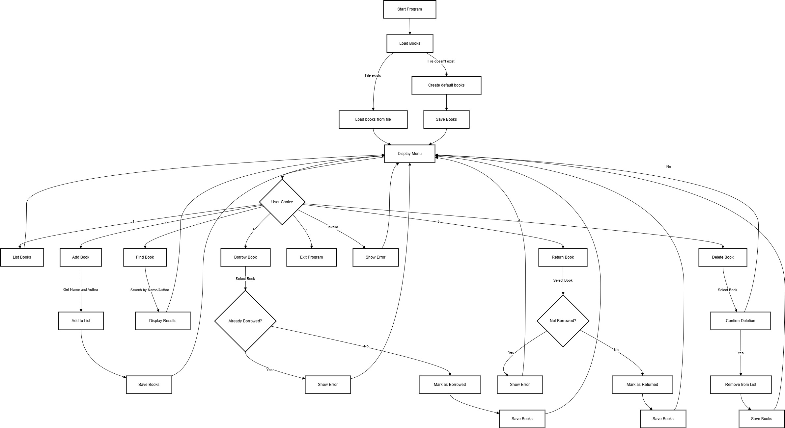

# Bokhanteringsprogram

Detta program hjälper till att hantera en samling böcker. Användaren kan visa, lägga till, söka, låna, returnera och ta bort böcker. Böckerna lagras i en fil kallad `books.txt`, som kan laddas och sparas vid behov.

## Huvudkomponenter

### Bokklass
- **Name**: Bokens namn eller titel.
- **Author**: Författaren till boken.
- **Borrowed**: En flagga som anger om boken är lånad (true) eller inte (false).
  
### Programklass
- **books**: En lista som lagrar alla böcker i systemet.
- **fileName**: Namnet på filen där bokdata sparas och laddas från.

Programmet erbjuder följande alternativ via en meny:

1. **Visa alla böcker**: Visar alla böcker med namn, författare och lånestatus.
2. **Lägg till bok**: Lägger till en ny bok genom att ange namn och författare.
3. **Sök bok**: Söker efter böcker baserat på namn eller författare.
4. **Låna bok**: Lånar en bok och markerar den som "lånad".
5. **Returnera bok**: Returnerar en bok och markerar den som "inte lånad".
6. **Ta bort bok**: Tar bort en bok från listan.
7. **Avsluta**: Stänger programmet.

## Hur det fungerar

### Laddning av böcker
Vid start försöker programmet ladda bokdata från filen `books.txt`. Om filen finns, läses böckerna in till listan. Om filen inte finns, läggs en uppsättning standardböcker till och sparas i filen.

### Spara böcker
Varje gång en bok läggs till, lånas, returneras eller tas bort sparas den uppdaterade listan av böcker till filen.

### Användarinteraktion
Programmet visar en meny där användaren kan välja ett alternativ. Vid behov ber programmet om ytterligare information (t.ex. namn på bok eller boknummer).

### Felhantering
Om ett fel uppstår (t.ex. filen finns inte eller felaktig inmatning) visas ett felmeddelande.

## Sammanfattning
Detta bokhanteringssystem gör det enkelt att hålla koll på böcker och deras status. Programmet lagrar data i en fil, vilket gör att informationen bevaras mellan körningar. Användaren interagerar med programmet genom en enkel meny.